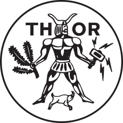

# Thor-promo-bot
### About the Telegram bot
A python based telegram bot.
This Telegram bot will list all the events of the Thor web site, this is done by loading the csv data of the Thor website.
Next to this it is also capable of posting all the current posters on the poster screen.


### How to use the Thor bot

The Thor promo bot can be used in two diffrent ways :

1. Add the Telegram bot to a chat 
2. Use the inline question option (this works in any chat) 


In order to add the telegram bot to a chat a user needs to activate the bot first this done by going to this link : telegram.me/Thor_promo_bot
here all functions have to be "called" to the bot these functions are :
```
    \thor - List all the upcoming Thor events
    \poster - Show all the current posters
    \photo - Show all the current posters
    \reset - Renew the data of the bot
    \about - Show information about the Thor bot
```

Further more can the Thor bot also be used if you directly message the bot using inline messages this is done by typing `@Thor_promo_bot ` the Thor bot will load all the upcoming events and a user must select one in order to learn more about them.


# Libary's used
This Python Telegram bot uses the following python packages :

- Telepot
- Beautifulsoup 4
- PyPushbullet
- Pillow


# To do list :
- [x] Debug the rss feed reload function
- [x] Add support for lower case or upper case commands
- [x] Send all Poster of every event
- [x] Parse the poster's with the event list~~
- [x] Automatic update of the data~~
- [ ] New event update
- [ ] Direct link to the subscription page (if any)
- [ ] Parse the poster with the event
- [ ] Parse the poster in the inline query

# Changelog  

- V1.0 First Version that works well enough to post
- V1.2 Added lowercase and upper case support
- V1.21 Minor bugfixes
- V2.0 Added a poster function from the poster.thor.edu website
- V2.01 Minor bugfixes
- V3.0 Added inline feedback support fixed a lot of bugs, used glance method, and many more improvements
- V3.01 Fixed the markdown logo
- V3.011 Updated the readme file
